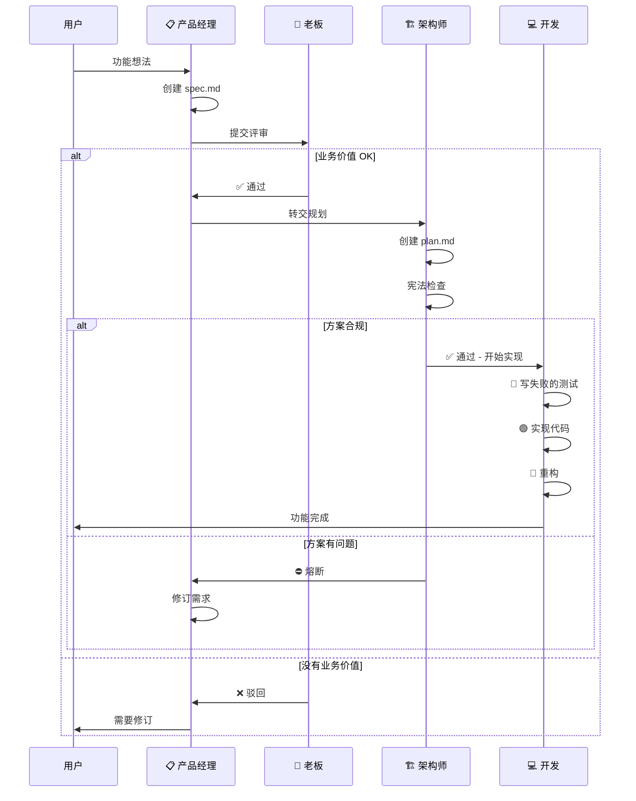

# 角色工作流参考

本文档描述四角色开发流程的完整工作流。

## 角色概览

```
┌─────────────────────────────────────────────────────────────────┐
│                       开发工作流                                  │
├─────────────────────────────────────────────────────────────────┤
│                                                                  │
│  🎩 老板（守门员）                                               │
│  └─→ 评审业务价值                                                │
│      └─→ 通过 / 驳回                                             │
│                                                                  │
│  📋 产品经理（需求定义）                                         │
│  └─→ 定义需求                                                    │
│      └─→ spec.md + 流程图                                        │
│                                                                  │
│  🏗️ 架构师（上下文）                                            │
│  └─→ 审查技术方案                                                │
│      └─→ 通过 / 熔断                                             │
│                                                                  │
│  💻 开发（领航员）                                               │
│  └─→ 执行 TDD                                                    │
│      └─→ 红灯 → 绿灯 → 重构                                      │
│                                                                  │
└─────────────────────────────────────────────────────────────────┘
```

## 完整流程时序图



## 交接协议

### 产品经理 → 老板
- 交付物：`specs/[feature]/spec.md`
- 必须包含：带验收标准的用户故事
- 必须包含：Mermaid 流程图

### 老板 → 产品经理（如通过）
- 交付物：评审报告
- 下一步：技术规划

### 产品经理 → 架构师
- 交付物：已批准的 spec.md
- 必须包含：清晰的边界定义

### 架构师 → 开发（如通过）
- 交付物：`plan.md`、`tasks.md`
- 必须满足：所有宪法检查通过

### 开发 → 用户
- 交付物：带测试的可工作代码
- 必须满足：所有测试绿灯

## 应急流程

### 熔断机制触发
当架构师发现关键问题时：
1. 停止所有开发工作
2. 记录具体违规项
3. 退回产品经理修订需求
4. 绝不带着缺陷方案继续

### 测试失败处理
当开发遇到意外失败时：
1. 停止实现
2. 分析根本原因
3. 修复后再继续
4. 测试失败时绝不标记任务完成
