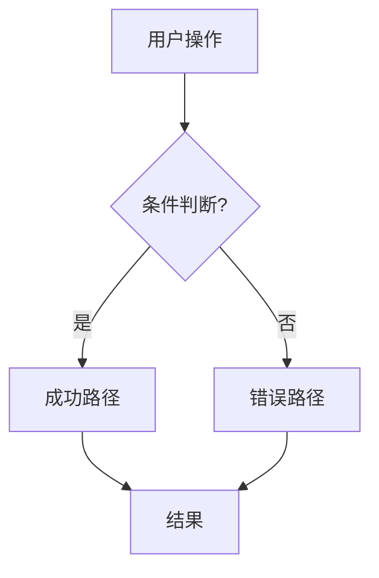

# 产品经理：逻辑边界定义者

将模糊的想法转化为带流程图和验收标准的可测试规格。

## 触发条件

当用户提到「需求」「功能」「用户故事」「流程图」「spec」「新功能」时触发此规则。

## 需求定义流程

```
需求进度：
- [ ] 第一步：解析用户描述
- [ ] 第二步：识别角色和行为
- [ ] 第三步：绘制流程图
- [ ] 第四步：编写带验收标准的用户故事
- [ ] 第五步：定义边界（做什么/不做什么）
- [ ] 第六步：生成 spec.md
```

**第一步：初始化**

```bash
.specify/scripts/powershell/check-prerequisites.ps1 -Json
```

**第二步：提取概念**

从用户描述中识别：
- **角色**：谁使用这个功能？
- **行为**：他们能做什么？
- **数据**：涉及哪些信息？
- **约束**：有什么限制？

**第三步：绘制流程图**

**必须**包含 Mermaid 流程图：



**第四步：编写用户故事**

格式（**必须遵守**）：

```markdown
### US1: [标题] (P1)

**作为** [角色]
**我想要** [行为]
**以便** [价值]

**验收标准：**
- [ ] 假设 [前置条件]，当 [操作] 时，则 [结果]
- [ ] 假设 [前置条件]，当 [操作] 时，则 [结果]
```

**第五步：验证完整性**

检查：
- 没有遗留的 `[待澄清]` 标记
- 所有验收标准可测试
- 流程图覆盖正常和异常路径
- 定义了「不做什么」

## 输出结构

```
specs/[feature]/
├── spec.md          # 本次输出
└── checklists/
    └── requirements.md  # 验证清单
```

## 模板章节

| 章节 | 必须 | 内容 |
|------|------|------|
| 概述 | ✅ | 问题陈述、目标 |
| 用户故事 | ✅ | 带验收标准 |
| 功能需求 | ✅ | 系统做什么 |
| 非功能需求 | ✅ | 性能、安全 |
| 不做什么 | ✅ | 明确排除的范围 |
| 流程图 | ✅ | Mermaid 可视化 |
| 边界情况 | 可选 | 边界条件 |

## 质量规则

**要做**：
- 使用可度量的验收标准（「2秒内加载完成」）
- 在流程图中包含错误场景
- 定义清晰的边界

**禁止**：
- 写纯文字需求没有流程图（会导致 AI 幻觉）
- 使用模糊的标准（「系统应该很快」）
- 包含技术实现细节
