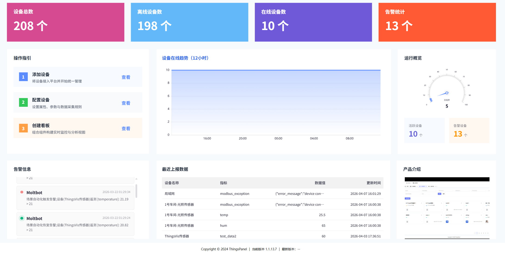
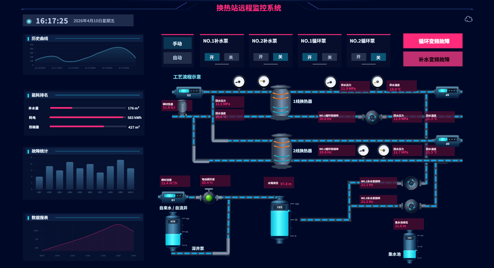
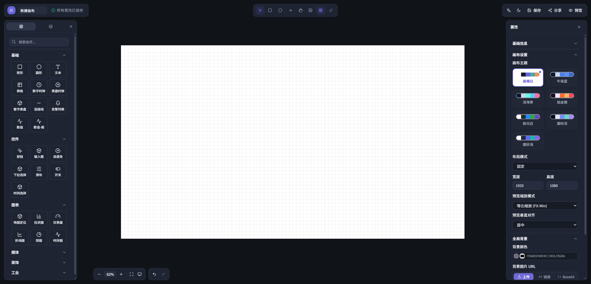
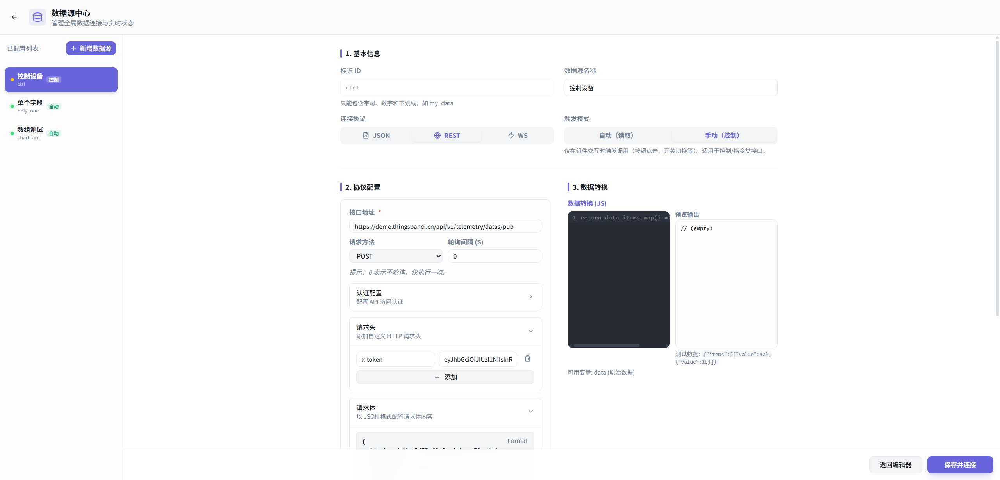

# ThingsVis

**专为现代 Web 与物联网（IoT）打造的数据可视化引擎与大屏工作台。**

[English](./README_EN.md) · [官方文档](./apps/docs/guide/introduction.md) · [Widget 开发规范](./apps/docs/development/quick-start.md)

<p align="center">
  
  
</p>
<p align="center">
  
  
</p>

## 什么是 ThingsVis？

ThingsVis 是面向现代 Web 与物联网场景的数据可视化引擎与大屏工作台，适合构建工业看板、监控大屏、数字孪生页面、设备控制面板和可嵌入式可视化模块。与偏报表分析、经营洞察的传统 BI 工具不同，ThingsVis 更关注复杂可视化界面、实时交互、工程化扩展和业务系统集成能力。

ThingsVis 的优势：

- AI 友好：基于 Zod 收敛统一 Schema 契约，视图描述结构化、可校验，天然适合大模型生成、修改和回放。
- 扩展灵活：提供 Widget 沙箱机制与 CLI/SDK，开发者可以像开发普通 React 包一样独立构建和发布业务组件。
- 集成轻量：核心能力沉淀为前端运行时 Kernel，可通过 SDK、组件或 iframe 方式嵌入现有 Web 系统与 SaaS 平台。
- 交互优先：不仅支持展示实时数据，还支持订阅、联动、动作触发和设备控制，适合需要闭环操作的 IoT 场景。
- 工程友好：采用 Monorepo 架构，清晰拆分 Studio、Kernel、Schema 与工具链，便于二次开发、维护与持续交付。

ThingsVis 适合的场景：

- 工业设备监控、产线看板、园区运营中心等实时大屏场景；
- 能源、楼宇、物联网设备管理等需要状态联动与控制闭环的业务场景；
- SaaS、低代码平台或行业系统中需要嵌入可视化能力的集成场景；
- 需要通过 AI 生成、调整和编排可视化页面的智能化场景。

---

## 快速开始

### 前置环境要求
- Node.js `>= 20.10.0`
- pnpm `>= 9.0.0`

### 启动本地前端开发环境

仅需三步，体验隔离式的纯前端开发者沙箱（包含 Studio 画布与 Kernel 引擎核心）：

```bash
pnpm install
pnpm build:widgets
pnpm dev
```

如需体验涉及真实认证授权、资源管理的完整闭环全栈服务，请启动：

```bash
pnpm dev:app
```

### 首次启动完整服务时，先初始化数据库与管理员账号

`pnpm dev:app` 会同时启动 Studio、Kernel 和 Server，但不会替你创建本地 PostgreSQL 数据库里的首个管理员用户。首次使用前，请先完成以下初始化：

1. 复制 `apps/server/.env.example` 为 `apps/server/.env`，并填好 `DATABASE_URL`、`AUTH_SECRET` 等必要环境变量。
2. 确保本地 PostgreSQL 已启动，并且 `DATABASE_URL` 指向可写库。
3. 在 `apps/server` 目录执行数据库建表与种子脚本：

```bash
cd apps/server
pnpm db:push
pnpm seed
```

默认会创建以下管理员账号：

- 邮箱：`admin@thingsvis.io`
- 密码：`admin123`

如需自定义初始化账号，可在 `apps/server/.env` 中覆盖以下环境变量后重新执行 `pnpm seed`：

```bash
SEED_ADMIN_EMAIL=admin@thingsvis.io
SEED_ADMIN_PASSWORD=admin123
SEED_ADMIN_NAME=Admin
```

完成后回到仓库根目录，再启动完整开发环境：

```bash
pnpm dev:app
```

> 如果登录页出现“服务器出错，请稍后重试”，通常是因为 `apps/server` 未成功启动、数据库未执行 `pnpm db:push`，或尚未运行 `pnpm seed` 创建初始管理员。

> **常用工程命令一览**：
> - `pnpm docs:dev`：在本地挂载官方文档站。
> - `pnpm typecheck` & `pnpm lint`：执行项目 TypeScript 全局检查与代码规则校验。
> - `pnpm test`：执行单元测试套件。

---

## 开发者体验：五分钟构建你的专属 Widget

我们重新定义了在大屏平台中扩展代码的技术体验。创建一个独立 Widget 犹如起草一个基础 React 项目：

```bash
pnpm vis-cli create <YourCategory> <YourWidgetName>
```

基于脚手架，我们为你规划了极度清晰的三步研发路径：
1. **Schema 契约**：在 `schema.ts` 中基于 Zod 提供精准的数据属性检验契约。
2. **可视面板**：在 `controls.ts` 中注册挂载交互属性控制面板。
3. **渲染视图**：在 `index.tsx` 提供 React `defineWidget` 完成真正的内容逻辑与样式。

深入探索这套隔离与插拔机制，请参阅：[CLI 架构与指南](./tools/cli/README.md) 或 [Widget SDK 说明](./packages/thingsvis-widget-sdk/README.md)。

---

## 核心技术栈与代码组织 (Architecture)

ThingsVis 是现代化的 Monorepo（基于 Turborepo），清晰分离了核心状态机、共享协议与运行时：

- **`apps/studio/`**: 承载了可视化的 Studio 画布编辑器入口与主视图。
- **`packages/thingsvis-kernel/`**: 高度解耦的无头（Headless）运行时环境及其状态管理核心。
- **`packages/thingsvis-schema/`**: 定义了整套平台运行生命周期与组件间通信的全局契约及类型。
- **`tools/cli/`**: 内置的开发者利器 —— 强大的 `vis-cli` 脚手架工具。

> 查看更详尽的设计参考： 
> - [系统全局变量使用指南](./apps/docs/guide/variables.md)
> - [第三方集成与嵌入指南](./docs/thingspanel-integration-guide.md)
> - [大屏标杆示例剖析](./apps/docs/guide/showcase-dashboard.md) 

---

## 参与开源共建 (Contributing)

ThingsVis 渴望更多开源开发者的想法碰撞！在您准备好提交第一份 PR 之前，请务必阅读我们的 [贡献指引(CONTRIBUTING.md)](./CONTRIBUTING.md)。

- 🐞 **上报缺陷**：请通过统一规范的 [Bug 追踪模板](./.github/ISSUE_TEMPLATE/bug-report.yml) 反馈给维护团队。
- ✨ **提出新特性**：如你有令人激动的创意，欢迎通过 [功能规划模板](./.github/ISSUE_TEMPLATE/feature-request.yml) 一同讨论。
- 📝 **代码提交规范**：我们严格遵循 [Conventional Commits](https://www.conventionalcommits.org/en/v1.0.0/)。若 PR 涉及用户可见界面或交互操作的变更，我们非常期待您能附带操作**截图**或**录屏**。

> 对于任何可能涉及框架安全设计的漏洞上报，请参照执行我们的 [官方安全策略 (SECURITY.md)](./SECURITY.md)。

---

## 许可证 (License)

ThingsVis 在 [Apache-2.0 许可证](./LICENSE) 下开源发布。
