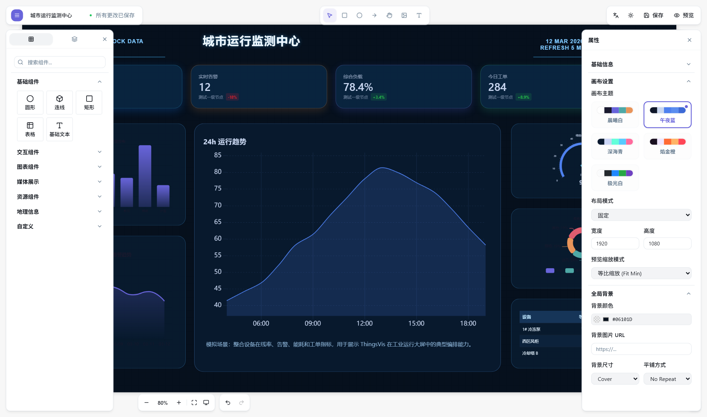

# ThingsVis

**专为现代 Web 与物联网（IoT）打造的数据可视化引擎与大屏工作台。**

[English](./README.md) · [文档文档](./apps/docs/guide/introduction.md) · [Widget 开发规范](./apps/docs/development/quick-start.md)



## 为什么选择 ThingsVis？

### 专为 AI 生成设计的底层协议（AI-Native）
**痛点**：传统可视化平台使用强耦合且离散的内部配置格式，极难对接当前流行的大语言模型以实现“自然语言建站”。
**重塑**：内核通过 Zod 强类型收敛了一致的可视化契约（Schema）。系统天然支持解析 100% 结构化的 JSON 视图蓝图，为 AI 问答直接生成完整工业大屏提供了绝佳的机器可读土壤。

### 零源码入侵的组件沙箱级扩展（Sandbox）
**痛点**：当业务需要扩充哪怕一个小小的饼图，开发者往往需要拉取成百上千兆的主引擎源码，忍受漫长且极易报错的全量打包。
**重塑**：专属的 CLI 和 SDK 套件带来纯粹的微前端级独立开发体验。外置组件就像普通的 React 包一样独立调试和单独构建，实现动态热插拔，全面告别与主系统代码的相互污染。

### 零后端依赖的无缝集成能力（Embed）
**痛点**：仅仅是想给已有项目附加一个数据看板模块，却常常被迫引入一整套沉重且部署繁杂的 Java 后端和微服务底座。
**重塑**：通过提纯出纯粹的前端运行时架构（Kernel），您可以做到真正的零后台绑定。只需简单的组件级 SDK 或 iframe 调用，即可将可视化基建无缝集成至任意第三方 SaaS 开发项目中。

### 支持反向控制的交互视口（IoT-Ready）
**痛点**：大量前端开源“竞品”多面向死板的缩放展示场景，只能单向“看”，面对需要真实互动的双向“设备控制”或指令下发时形同摆设。
**重塑**：原生注入基于订阅源的设备通信通道和动作触发器。无论是自适应的网格 Dashboard 还是设备状态开关操作，真正实现将大屏升格为一套可操作的工业物联网控制面板。

---

## 快速开始

### 前置环境要求
- Node.js `>= 20.10.0`
- pnpm `>= 9.0.0`

### 启动本地前端开发环境

仅需三步，体验隔离式的纯前端开发者沙箱（包含 Studio 画布与 Kernel 引擎核心）：

```bash
pnpm install
pnpm build:widgets
pnpm dev
```

如需体验涉及真实认证授权、资源管理的完整闭环全栈服务，请启动：

```bash
pnpm dev:app
```

> **常用工程命令一览**：
> - `pnpm docs:dev`：在本地挂载官方文档站。
> - `pnpm typecheck` & `pnpm lint`：执行项目 TypeScript 全局检查与代码规则校验。
> - `pnpm test`：执行单元测试套件。

---

## 开发者体验：五分钟构建你的专属 Widget

我们重新定义了在大屏平台中扩展代码的技术体验。创建一个独立 Widget 犹如起草一个基础 React 项目：

```bash
pnpm vis-cli create <YourCategory> <YourWidgetName>
```

基于脚手架，我们为你规划了极度清晰的三步研发路径：
1. **Schema 契约**：在 `schema.ts` 中基于 Zod 提供精准的数据属性检验契约。
2. **可视面板**：在 `controls.ts` 中注册挂载交互属性控制面板。
3. **渲染视图**：在 `index.tsx` 提供 React `defineWidget` 完成真正的内容逻辑与样式。

深入探索这套隔离与插拔机制，请参阅：[CLI 架构与指南](./tools/cli/README.md) 或 [Widget SDK 说明](./packages/thingsvis-widget-sdk/README.md)。

---

## 核心技术栈与代码组织 (Architecture)

ThingsVis 是现代化的 Monorepo（基于 Turborepo），清晰分离了核心状态机、共享协议与运行时：

- **`apps/studio/`**: 承载了可视化的 Studio 画布编辑器入口与主视图。
- **`packages/thingsvis-kernel/`**: 高度解耦的无头（Headless）运行时环境及其状态管理核心。
- **`packages/thingsvis-schema/`**: 定义了整套平台运行生命周期与组件间通信的全局契约及类型。
- **`tools/cli/`**: 内置的开发者利器 —— 强大的 `vis-cli` 脚手架工具。

> 查看更详尽的设计参考： 
> - [系统全局变量使用指南](./apps/docs/guide/variables.md)
> - [第三方集成与嵌入指南](./docs/thingspanel-integration-guide.md)
> - [大屏标杆示例剖析](./apps/docs/guide/showcase-dashboard.md) 

---

## 参与开源共建 (Contributing)

ThingsVis 渴望更多开源开发者的想法碰撞！在您准备好提交第一份 PR 之前，请务必阅读我们的 [贡献指引(CONTRIBUTING.md)](./CONTRIBUTING.md)。

- 🐞 **上报缺陷**：请通过统一规范的 [Bug 追踪模板](./.github/ISSUE_TEMPLATE/bug-report.yml) 反馈给维护团队。
- ✨ **提出新特性**：如你有令人激动的创意，欢迎通过 [功能规划模板](./.github/ISSUE_TEMPLATE/feature-request.yml) 一同讨论。
- 📝 **代码提交规范**：我们严格遵循 [Conventional Commits](https://www.conventionalcommits.org/en/v1.0.0/)。若 PR 涉及用户可见界面或交互操作的变更，我们非常期待您能附带操作**截图**或**录屏**。

> 对于任何可能涉及框架安全设计的漏洞上报，请参照执行我们的 [官方安全策略 (SECURITY.md)](./SECURITY.md)。

---

## 许可证 (License)

ThingsVis 在 [Apache-2.0 许可证](./LICENSE) 下开源发布。
