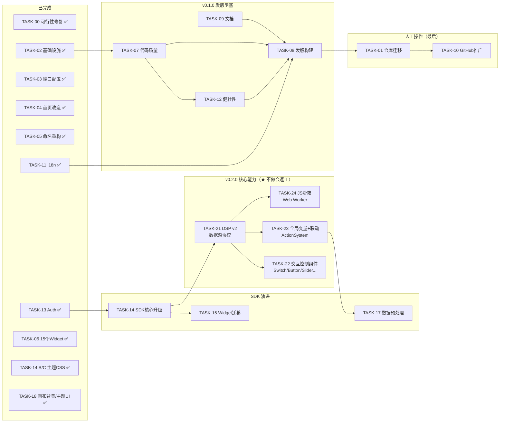

  # ThingsVis v0.1.0 上线全景图

> **生成日期**：2026-02-25
> **用途**：所有任务的统一视图 + 缺失项分析，确保一次性完成、不留重构债务
> **最后更新**：2026-02-28

---

## 一、任务总体进度

```
已完成 ────────────────────────────────────────
  TASK-00  端到端可行性修复                      P0 致命   ✅
  TASK-02  致命基础设施补全                      P0        ✅
  TASK-03  部署端口与服务器配置                  P0        ✅ 代码完成（人工收尾）
  TASK-04  首页改造                             P0        ✅
  TASK-05  命名重构 Plugin->Widget               P1        ✅
  TASK-06  缺失组件补齐（15个Widget已就绪）        P1/P2     ✅ MQTT数据源→TASK-21；新交互组件→TASK-22
  TASK-11  国际化 i18n 多语言                    P1        ✅
  TASK-13  Auth修复与数据库初始化                P0        ✅
  TASK-14  SDK核心升级（14-B/C主题部分）          P1        ✅ 14-D生命周期/14-E迁移机制待做
  TASK-18  画布背景与主题UI                      P2        ✅ 背景色/网格/左侧面板折叠/主题优化

代码自动化任务（当前待执行）────────────────────
  === v0.1.0 发版阻塞 ===
  TASK-07  代码质量与安全                      P0/P1    <- 1-1.5天
  TASK-09  文档                              P0/P1    <- 0.5-1天
  TASK-12  健壮性加固                          P1       <- 0.5-1天
  TASK-08  发版工程（构建/CI）                  P0       <- 0.5天

  === v0.2.0 核心能力（不做会导致架构返工）===
  TASK-21  数据源协议v2（DSP v2）               P0       <- 3-4天 ★ 优先
  TASK-22  交互控制组件体系                      P1       <- 4-5天
  TASK-23  全局变量与联动系统                    P1       <- 2-3天
  TASK-24  JS数据转换沙箱（Web Worker）          P2       <- 1-2天

  === SDK 演进（剩余）===
  TASK-14  SDK核心升级（14-D生命周期/14-E迁移机制）P1      <- 1-2天
  TASK-15  Widget迁移到SDK                    P1       <- 1-2天
  TASK-16  Widget尺寸约束与元数据（text已做）   P2       <- 0.5天
  TASK-17  数据预处理与组件间通信               ➡️       已并入 TASK-23
  TASK-18  画布背景与主题UI                    P2       ✅ 已完成
  TASK-19  CLI增强与开发工具链                  P2       <- 2天
  TASK-20  开发者文档门户                       P2       <- 3天

人工操作任务（代码全部完成后统一处理）───────────
  TASK-01  开源仓库迁移（Squash+Apache-2.0）    <- 最后做，1-2h 人工
  TASK-08  发版工程（Tag/Release）              <- 人工发布
  TASK-10  GitHub仓库配置与社区推广             <- 人工推广
```

---

## 二、执行顺序与依赖关系



---

## 三、新增任务详情（v0.2.0 核心能力）

### TASK-21：数据源协议v2（DSP v2）— ★ 最高优先级新任务

> **优先级**：P0（不做=数据源架构永远耦合ThingsPanel，后续无法扩展）
> **预估工时**：3-4 天
> **影响**：解决数据源硬编码问题，是TASK-22/23/24的前置

**核心设计**：
- `DataSourceAdapter` 统一接口（connect/disconnect/data$/write）
- `FieldMapping` 改用 JSONPath 表达式（支持数组、嵌套、内联transform）
- `PlatformAdapter` 插件化：ThingsPanel 降为可选插件，向后兼容现有 Dashboard JSON
- `ScriptAdapter`：用户自定义JS数据源（接 TASK-24 沙箱）

**向后兼容策略**：
- 解析时若发现 `source:'ThingsPanel'` 旧格式，自动迁移为 `type:'platform', provider:'thingspanel'`
- ThingsPanel 端（前端社区版）**无需任何改动**，postMessage 协议不变
- 数据库已有 Dashboard 通过迁移脚本一次性升级

**产出文件**：
- `packages/thingsvis-schema/src/datasource/adapter.ts` — 核心接口
- `packages/thingsvis-kernel/src/adapters/` — 各适配器实现
- `packages/thingsvis-kernel/src/adapters/platform/thingspanel.ts` — TP插件
- `scripts/migrate-datasource-v2.mjs` — 自动迁移旧 Dashboard JSON

---

### TASK-22：交互控制组件体系

> **优先级**：P1
> **预估工时**：4-5 天
> **前置依赖**：TASK-21（DSP v2 write接口）、TASK-14（SDK）

**组件清单（第一批）**：

| 组件 | 功能要点 | 估时 |
|------|---------|------|
| `Switch`（完整版） | 开/关 + 中间态 + 乐观更新 + 确认弹窗 + 回滚 | 1d |
| `Button` | 触发 ActionSystem（写/变量/导航/脚本） | 0.5d |
| `Slider` | 数值调节 + 防抖写入 | 0.5d |
| `Input / NumberInput` | 文本/数值输入，提交触发动作 | 0.5d |
| `Select / Dropdown` | 选择器，修改全局变量或触发写操作 | 0.5d |
| `DateRangePicker` | 时间范围，影响全局 `$var.timeRange` | 0.5d |
| `ValueCard` | 数值卡片（含趋势箭头、单位、颜色条件） | 0.5d |
| `ProgressBar` | 液位/进度，条件着色 | 0.5d |

**开关特殊设计（乐观更新+回滚）**：
```
用户点击 → UI立即切换（乐观）→ 调 adapter.write()
  ├── 成功（或无确认通道）→ 保持
  └── 超时/失败 → UI回滚 + 错误Toast
```

---

### TASK-23：全局变量与联动系统

> **优先级**：P1
> **预估工时**：2-3 天
> **前置依赖**：TASK-21

**核心能力**：
- `DashboardVariables`（`$var.*`）：大盘级响应式变量
- 所有数据源、所有组件属性可引用 `{{ $var.xxx }}`，变量变化自动触发刷新
- `ActionSystem`：组件事件 → 动作映射

**四种动作类型**：
```yaml
# 在组件 schema 的 events 字段中配置
onClick:
  - action: setVariable      # 修改全局变量
    target: $var.deviceId
    value: "{{row.id}}"

  - action: callWrite        # 写数据源（调 adapter.write）
    datasource: ds-001
    key: "switch"
    value: "{{!$data.value}}"

  - action: navigate         # 跳转大盘状态
    to: "state:detail"

  - action: runScript        # 执行用户JS（受沙箱限制）
    script: "alert('hello')"
```

**编辑器 UI**：右侧属性面板新增「事件」Tab，可视化配置上述动作

---

### TASK-24：JS数据转换沙箱

> **优先级**：P2
> **预估工时**：1-2 天
> **前置依赖**：TASK-21

- 每个数据源支持配置 `transform` 脚本
- 在 **Web Worker** 中安全执行，无法访问 DOM 和主线程
- 超时限制 5s，错误自动降级为原始数据
- 编辑器内置脚本 Monaco 编辑器 + 实时预览

---

## 四、总工时估算（更新版）

| 类别 | 任务 | 工时 | 状态 |
|------|------|------|------|
| **已完成** | TASK-00/02/03/04/05/11/13 | - | ✅ |
| **已完成(P1)** | TASK-06（15个Widget）、TASK-14-B/C（主题CSS）、TASK-18（画布背景/主题UI） | - | ✅ |
| **v0.1.0阻塞** | TASK-07 代码质量 | 1-1.5d | 🔲 |
| | TASK-09 文档 | 0.5-1d | 🔲 |
| | TASK-12 健壮性加固 | 0.5-1d | 🔲 |
| | TASK-08 发版(构建) | 0.5d | 🔲 |
| **v0.2.0新增** | TASK-21 DSP v2 | 3-4d | 🆕 |
| | TASK-22 交互控制组件 | 4-5d | 🆕 |
| | TASK-23 全局变量+联动 | 2-3d | 🆕 |
| | TASK-24 JS沙箱 | 1-2d | 🆕 |
| **SDK演进** | TASK-14 SDK升级（14-D/E剩余） | 1-2d | 🔄 |
| | TASK-15 Widget迁移 | 1-2d | 🔲 |
| **人工操作** | TASK-01 仓库迁移 | 1-2h | ⏸️ 最后 |
| | TASK-10 推广 | 0.5d | ⏸️ 最后 |

---

## 五、重构风险评估（更新版）

| 任务 | 不做就发版的后果 | 会返工吗？ |
|------|----------------|-----------|
| TASK-21 DSP v2 | 数据源永远耦合ThingsPanel，每新平台=全改 | **必须做，越晚越痛** |
| TASK-23 联动系统 | Widget间无法通信，无法构建复杂大盘 | **必须做，影响所有组件** |
| TASK-22 交互组件 | 只能展示不能控制，定位大幅受限 | 可延后到v0.2.0 |
| TASK-07 代码质量 | console.log泄漏、lint不过 | 小范围修改 |
| TASK-11 i18n | ✅ 已完成，无风险 | - |
| TASK-09 文档 | 用户无法上手 | 不涉及代码重构 |

---

## 四、总工时估算

| 类别 | 任务 | 工时 | 状态 |
|------|------|------|------|
| **已完成** | TASK-00/02/04/05/06 | - | 已完成 |
| **代码自动化** | TASK-07 代码质量 | 1-1.5d | 待执行 |
| | TASK-11 i18n | 2-3d | ✅ 已完成 |
| | TASK-09 文档 | 0.5-1d | 待执行 |
| | TASK-12 健壮性加固 | 0.5-1d | 待执行 |
| | TASK-08 发版(构建) | 0.5d | 待执行 |
| **人工操作** | TASK-01 仓库迁移 | 1-2h | 最后做 |
| | TASK-03 服务器配置 | 人工 | 最后做 |
| | TASK-10 推广 | 0.5d | 最后做 |

### 最小可发版路径 (MVP) - 代码优先

```
=== 代码自动化（不需人工） =================
TASK-07 代码质量     -> 1天       <- 可自动化
TASK-11 i18n        -> 2天       <- 可自动化、防重构
TASK-12 健壮性加固   -> 0.5天     <- 可自动化、防重构
TASK-09 文档        -> 0.5天     <- 可自动化
TASK-08 发版(构建)   -> 0.5天     <- 可自动化
─────────────────────────────
代码部分: ~4.5天 可完成

=== 人工操作（统一收尾） =================
TASK-01 仓库迁移    -> 1-2h
TASK-03 服务器配置   -> 人工
TASK-10 社区推广    -> 0.5天
```

TASK-06（缺失组件）可延后到 v0.1.1。

---

## 五、重构风险评估

> 以下表格回答：**"如果不做这个任务就发版，以后会不会被迫重构？"**

| 任务 | 不做就发版的后果 | 会重构吗？ |
|------|----------------|-----------|
| TASK-07 代码质量 | console.log 泄漏、lint 不过 | 小范围修改 |
| TASK-09 文档 | 用户无法上手 | 不需要重构代码 |
| TASK-11 i18n | 架构层面无 i18n -> 后续每个组件都要改 | **必须重构** |
| TASK-06 组件补齐 | 功能少但不影响架构 | 仅增量开发 |
| TASK-12 健壮性加固 | 白屏崩溃/路由漏洞/暗色模式半成品 | 小范围修改 |
| TASK-01 仓库迁移 | 无法公开 | 不涉及代码 |
| TASK-08 发版 | 无法发布 | 流程操作 |
| TASK-10 推广 | 无人知晓 | 非代码 |

> [!CAUTION]
> **TASK-11 (i18n) 是唯一会导致全面重构的任务**。如果不在 v0.1.0 做，后续每新增一个组件/页面都会产生重构债务。68+ 文件需要从 `labelZh()` 迁移到 `t()`，越晚做越痛苦。
