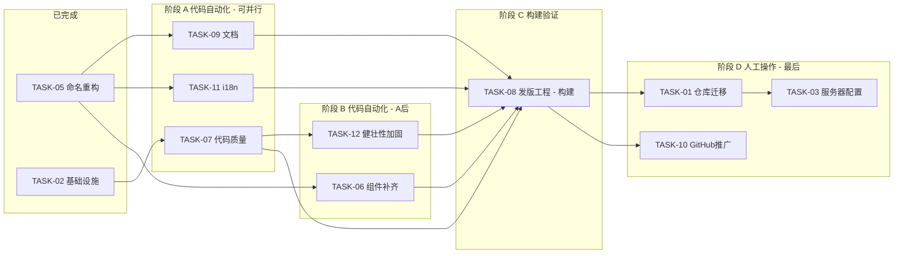

  # ThingsVis v0.1.0 上线全景图

> **生成日期**：2026-02-25
> **用途**：所有任务的统一视图 + 缺失项分析，确保一次性完成、不留重构债务
> **最后更新**：2026-02-25

---

## 一、任务总体进度

```
已完成 ────────────────────────────────────────
  TASK-00  端到端可行性修复                      P0 致命
  TASK-02  致命基础设施补全                      P0
  TASK-04  首页改造                             P0
  TASK-05  命名重构 Plugin->Widget               P1
  TASK-06  缺失组件补齐                         P1/P2

代码自动化任务 ─────────────────────────────────
  阶段 A（可并行）
    TASK-07  代码质量与安全                    P0/P1  <- 1-1.5天
    TASK-11  国际化 i18n 多语言                P1     <- 2-3天
    TASK-09  文档                            P0/P1  <- 0.5-1天
  阶段 B（A 完成后，可并行）
    TASK-12  健壮性加固                        P1     <- 0.5-1天
  阶段 C（构建验证）
    TASK-08  发版工程（构建/CI）               P0     <- 0.5天

人工操作任务（代码全部完成后统一处理）───────────
  TASK-01  开源仓库迁移                        <- 1-2h 人工
  TASK-03  部署端口与服务器配置                  <- 人工服务器
  TASK-08  发版工程（Tag/Release）             <- 人工发布
  TASK-10  GitHub仓库配置与社区推广              <- 人工推广
```

---

## 二、执行顺序与依赖关系



---

## 三、未覆盖缺失项分析（防重构清单）

> 以下 **7 项** 是现有 TASK-00 ~ TASK-11 **未覆盖或覆盖不足** 的，已合并到 **TASK-12 健壮性加固**。

| # | 缺失项 | 风险 | 工作量 |
|---|--------|------|--------|
| 1 | 全局 ErrorBoundary | 任何组件报错 -> 白屏 | 1-2h |
| 2 | .env.example 缺失 | 新用户 clone 后启动失败 | 30min |
| 3 | 暗色模式切换 | CSS 半成品不可用 -> issue | 1-2h |
| 4 | 首屏 Loading 态 | 首次打开白屏/跳动 | 1-2h |
| 5 | SEO 基础 | 分享链接无预览图 | 30min |
| 6 | ProtectedRoute 脱保 | 未登录访问受保护路由 -> 泄露 | 1h |
| 7 | CODE_OF_CONDUCT | GitHub Community health 不全 | 30min |

> 详细说明见 [TASK-12-健壮性加固.md](./TASK-12-健壮性加固.md)

---

## 四、总工时估算

| 类别 | 任务 | 工时 | 状态 |
|------|------|------|------|
| **已完成** | TASK-00/02/04/05/06 | - | 已完成 |
| **代码自动化** | TASK-07 代码质量 | 1-1.5d | 待执行 |
| | TASK-11 i18n | 2-3d | ✅ 已完成 |
| | TASK-09 文档 | 0.5-1d | 待执行 |
| | TASK-12 健壮性加固 | 0.5-1d | 待执行 |
| | TASK-08 发版(构建) | 0.5d | 待执行 |
| **人工操作** | TASK-01 仓库迁移 | 1-2h | 最后做 |
| | TASK-03 服务器配置 | 人工 | 最后做 |
| | TASK-10 推广 | 0.5d | 最后做 |

### 最小可发版路径 (MVP) - 代码优先

```
=== 代码自动化（不需人工） =================
TASK-07 代码质量     -> 1天       <- 可自动化
TASK-11 i18n        -> 2天       <- 可自动化、防重构
TASK-12 健壮性加固   -> 0.5天     <- 可自动化、防重构
TASK-09 文档        -> 0.5天     <- 可自动化
TASK-08 发版(构建)   -> 0.5天     <- 可自动化
─────────────────────────────
代码部分: ~4.5天 可完成

=== 人工操作（统一收尾） =================
TASK-01 仓库迁移    -> 1-2h
TASK-03 服务器配置   -> 人工
TASK-10 社区推广    -> 0.5天
```

TASK-06（缺失组件）可延后到 v0.1.1。

---

## 五、重构风险评估

> 以下表格回答：**"如果不做这个任务就发版，以后会不会被迫重构？"**

| 任务 | 不做就发版的后果 | 会重构吗？ |
|------|----------------|-----------|
| TASK-07 代码质量 | console.log 泄漏、lint 不过 | 小范围修改 |
| TASK-09 文档 | 用户无法上手 | 不需要重构代码 |
| TASK-11 i18n | 架构层面无 i18n -> 后续每个组件都要改 | **必须重构** |
| TASK-06 组件补齐 | 功能少但不影响架构 | 仅增量开发 |
| TASK-12 健壮性加固 | 白屏崩溃/路由漏洞/暗色模式半成品 | 小范围修改 |
| TASK-01 仓库迁移 | 无法公开 | 不涉及代码 |
| TASK-08 发版 | 无法发布 | 流程操作 |
| TASK-10 推广 | 无人知晓 | 非代码 |

> [!CAUTION]
> **TASK-11 (i18n) 是唯一会导致全面重构的任务**。如果不在 v0.1.0 做，后续每新增一个组件/页面都会产生重构债务。68+ 文件需要从 `labelZh()` 迁移到 `t()`，越晚做越痛苦。
