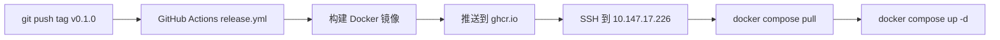

# 🚀 ThingsVis 发布任务总清单

> 覆盖**开源仓库迁移 + 部署配置 + 基础设施补全 + 命名重构 + 组件补齐 + 发版工程 + 社区运营**全生命周期。
> 基于代码库实际文件扫描（2026-02-24），许可证决策 Apache-2.0。

---

## ⚡ 端到端可行性分析 — 用户能一次跑起来吗？

> 模拟两个用户路径：**本地开发** 和 **Docker 部署**，追踪每一步是否能成功。

### 路径一：Docker 部署（`docker compose up -d`）

```
用户操作                    结果       阻塞原因
────────────────────────    ────       ────────
1. docker compose up -d     ✅ 能启动   Server + Studio 容器启动
2. 打开 http://host:3000    ✅ 页面出来  Studio Nginx 返回 SPA
3. 注册/登录                ❌ 失败!!   Studio 前端调 API 用 window.location.origin
                                       = http://host:3000/api/v1
                                       但 Server 在 8000 端口 → 404
```

**🔴 致命问题 1：Studio → Server API 通信断裂**

| 问题 | `client.ts` 用 `window.location.origin` 拼 API URL → `http://host:3000/api/v1` |
|------|------|
| 原因 | Studio 容器 Nginx **只做 SPA fallback，没有 `/api/` 反向代理** |
| 结果 | 所有 API 请求 404 → **登录、注册、加载项目全部失败** |
| 修复 | Studio Dockerfile Nginx 配置加 `/api/` → `proxy_pass http://thingsvis-server:8000` |

> 这是**最关键**的阻塞项。不修复 → 部署后前端是个空壳。

---

**🔴 致命问题 2：Widget 文件不在 Docker 镜像中**

```
用户操作                    结果
────────────────────────    ────
4. 登录成功后打开编辑器      ✅ 编辑器页面加载
5. 工具栏加载 Widget 列表    ❌ 空白!!
```

| 问题 | Studio Dockerfile 只 `COPY apps/studio/dist` → **plugins/ 目录完全不在镜像中** |
|------|------|
| 原因 | `registry.json` 里 `staticEntryUrl` 指向 `/widgets/basic/text/dist/remoteEntry.js`，但镜像内没这个文件 |
| 结果 | **编辑器工具栏空白，拖不出任何组件** |
| 修复 | 方案 A：Studio Dockerfile 构建阶段也构建 plugins，COPY 到 nginx html<br/>方案 B：docker-compose 挂载 volume 或单独 plugins 容器 |

---

**🟡 问题 3：registry.json 需同步清理**

| 当前注册（8 个） | 需删除（3 个） | 保留（5 个） |
|-------------|------------|----------|
| text, rectangle, circle, line, indicator, image, echarts-line, water-tank | **indicator, water-tank**, pm25-card（未注册但目录存在） | text, rectangle, circle, line, image, echarts-line |

- [ ] **P0** 删除 `plugins/basic/indicator/` 目录
- [ ] **P0** 删除 `plugins/basic/pm25-card/` 目录
- [ ] **P0** 删除 `plugins/custom/water-tank/` 目录（整个 `plugins/custom/` 可删）
- [ ] **P0** `registry.json` 移除 indicator、water-tank 条目
- [ ] **P0** `pnpm-workspace.yaml` / `turbo.json` 确认无残留引用

---

**🟡 问题 4：首次部署无法登录 — 没有默认用户**

| 问题 | 无 Prisma seed，首次 `docker compose up` 后数据库为空 |
|------|------|
| 影响 | 用户打开页面 → 没有账号 → **必须先知道注册页面 URL 存在** |
| 修复 | 方案 A：添加 `prisma/seed.ts` 创建默认 admin 用户<br/>方案 B：首页重定向到注册页（如无账号时）<br/>方案 C：README 中明确说明需先注册 |

- [ ] **P0** 决策默认用户方案（推荐方案 A，seed 创建 admin/admin123）

---

### 路径二：本地开发（`pnpm dev:all`）

```
用户操作                    结果       说明
────────────────────────    ────       ────────
1. git clone + pnpm install ✅ 能成功   pnpm-workspace 正常
2. pnpm dev:all             ⚠️ 部分成功 启动 studio + server
                                       但没有 .env → server 用 fallback 配置
3. 打开 http://localhost:3000 ✅       Studio rspack dev server
4. 注册/登录                ✅ 能成功   dev 时 client.ts fallback 到 localhost:3001
5. 加载 Widget              ⚠️         registry.json debugSource=static
                                       → 需要先 pnpm build:widgets
```

| 问题 | 说明 | 修复 |
|------|------|------|
| 无 `.env.example` | 用户不知道需要哪些环境变量 | 创建 `.env.example` |
| Widget 需先构建 | `pnpm dev:all` 不自动构建 plugins | README 说明 or 添加 `dev:full` 脚本 |
| `AUTH_SECRET` 硬编码 fallback | 开发能跑但生产危险 | 提示用户必须设置 |

---

### 汇总：当前任务清单缺失的阻塞项

| # | 缺失项 | 优先级 | 现有清单有否 |
|---|--------|--------|------------|
| 1 | **Studio Nginx 加 `/api/` 反向代理** | **P0 致命** | ✅ 2.4 有提到但非任务项 |
| 2 | **Plugins 打包进 Studio Docker 镜像** | **P0 致命** | ❌ 完全缺失 |
| 3 | **registry.json 补充 pm25-card** | P0 | ❌ 缺失 |
| 4 | **首次部署默认用户（seed）** | P0 | ❌ 缺失 |
| 5 | **README 添加本地开发要先构建 plugins 说明** | P1 | ❌ 缺失 |

---

## 〇、🏗️ 开源仓库迁移（发版前第一步）

> 当前私有仓库：229 commits（AI 生成 message）、36+ 分支（含 hash 命名）、历史中残留凭据、1185 个竞品分析文件。**必须新建公开仓库。**

### 为什么必须新建

| 风险 | 详情 |
|------|------|
| **凭据泄露** | 历史 commit 有 `remove hardcoded credentials`，`git log -p` 可能泄露密钥 |
| **体积膨胀** | `excalidraw-analysis/`（1185 文件）在 git 中，`git filter-repo` 清理风险大 |
| **分支混乱** | `18fedc0`、`9ec89ca` 等 hash 命名分支 |
| **内部文件** | `specs/`（28 个需求规格书）、`.specify/`（AI 工具数据）不应公开 |

### 迁移任务

- [ ] **P0** 新建 GitHub 公开仓库 `ThingsPanel/thingsvis`
- [ ] **P0** 从私有仓库复制代码，排除以下内容：

| 🔴 必须排除 | 理由 |
|-------------|------|
| `excalidraw-analysis/` | 竞品分析，1185 文件 |
| `.specify/` | AI 辅助工具数据 |
| `specs/` | 28 个内部需求规格书 |
| `.tmp/` / `.deploy/` | 临时文件 / 含服务器地址 |
| `docs/release-checklist.md` / `release-task-list.md` | 内部文档 |
| `.env*`（除 `.env.example`） | 环境变量 |
| `*.db` / `*.sqlite*` | 数据库文件 |
| `.cursor/` / `.cursorrules` / `.claude/` | AI 工具配置 |
| `.github/agents/` / `.github/prompts/` / `.github/skills/` | 内部 AI 配置 |

- [ ] **P0** Squash 到单个 commit：`feat: initial release of ThingsVis v0.1.0`
- [ ] **P0** Push 并打 tag `v0.1.0`

---

## 一、💀 致命基础设施缺失

### 1.1 🚨 LICENSE 文件

| 现状 | 根目录无 `LICENSE`，README 写 `[Add your license information here]` |
|------|------|
| 影响 | 无 LICENSE = 不是开源项目，推广全部失效 |
| 决策 | **Apache-2.0**（IoT 行业标准，支持 Open Core 企业版模式） |

- [ ] **P0** 创建根目录 `LICENSE` 文件（Apache-2.0）
- [ ] **P0** 更新 README.md 许可证章节
- [ ] **P1** `license-checker` 依赖兼容性检查

---

### 1.2 🚨 `.env.example` 缺失

| 现状 | 整个仓库无 `.env.example`，`.gitignore` 排除所有 `.env*` |
|------|------|
| 影响 | `release.yml` 第 116 行引用此文件 → **打包必定失败**；用户 docker-compose 首次报错 |

- [ ] **P0** 创建 `apps/server/.env.example`（含 `DATABASE_URL`, `AUTH_SECRET`, `AUTH_URL`, `PORT`）
- [ ] **P0** `.gitignore` 添加 `!.env.example`

---

### 1.3 🚨 React ErrorBoundary 缺失

| 现状 | Studio 中无 `ErrorBoundary`，README 声称有错误隔离但代码未实现 |
|------|------|
| 影响 | 任何 Widget JS 错误 → 整个编辑器白屏崩溃 |

- [ ] **P0** Widget 渲染区添加 `<ErrorBoundary>` 包裹
- [ ] **P1** Fallback UI（"组件加载失败" + 重试按钮）

---

### 1.4 版本号 `0.0.0`

- [ ] **P0** 所有 `package.json` 版本号更新为 `0.1.0`

---

### 1.5 Preview 引用不存在

| 现状 | `docker-compose.yml` 和 `release.yml` 引用 `apps/preview/`，**该目录不存在** |
|------|------|
| 影响 | Docker 构建必定失败 |

- [ ] **P0** 决策：删除 preview 相关配置 or 恢复 `apps/preview/`
- [ ] **P0** 同步更新 docker-compose.yml + release.yml

---

### 1.6 `.gitignore` / `.dockerignore`

- [ ] **P0** `.gitignore` 添加 `excalidraw-analysis/`、`specs/`、`.specify/`
- [ ] **P0** `.dockerignore` 确认排除大目录

---

### 1.7 `release.yml` 隐患

| 问题 | Plugin/Preview 构建设 `continue-on-error: true` → 构建失败静默跳过 → tar.gz 中 plugins/ 为空 |
|------|------|

- [ ] **P0** 移除 `continue-on-error` 或添加产物完整性校验

---

## 二、🔌 部署端口与服务器配置

> **目标端口**：前端 Studio = `3000`，后端 Server = `8000`
> **目标服务器**：`10.147.17.226`（root / Things）

### 2.1 端口变更策略

> **不做端口映射**，容器内直接监听目标端口。

| 服务 | 当前 | 目标 | 改动位置 |
|------|------|------|---------|
| Server | 容器内 3001，docker `3001:3001` | 容器内 **8000**，docker `8000:8000` | Dockerfile `ENV PORT` / `EXPOSE` |
| Studio | 容器内 Nginx 80，docker `7050:80` | 容器内 Nginx **3000**，docker `3000:3000` | Dockerfile `listen 3000` |
| Preview | 7051（已废弃） | 删除 | docker-compose 删 preview |

### 2.2 需要修改的文件清单（12+ 处）

**后端 3001 → 8000：**

| 文件 | 位置 | 改动 |
|------|------|------|
| `apps/server/Dockerfile` | L53 `ENV PORT` | 3001 → 8000 |
| `apps/server/Dockerfile` | L70 `EXPOSE` | 3001 → 8000 |
| `apps/server/Dockerfile` | L73 healthcheck | localhost:3001 → :8000 |
| `apps/server/Dockerfile` | L39 `AUTH_URL` | localhost:3001 → :8000 |
| `docker-compose.yml` | L15 端口 | `3001:3001` → `8000:8000` |
| `docker-compose.yml` | L26 healthcheck | localhost:3001 → :8000 |
| `apps/server/src/middleware.ts` | L9,13,20 CORS | :3001 → :8000 |
| `apps/studio/src/lib/api/client.ts` | L9 fallback URL | :3001 → :8000 |
| `apps/studio/src/lib/api/uploads.ts` | L25 API_BASE_URL | :3001 → :8000 |
| `apps/studio/.env.development` | L9 注释 | :3001 → :8000 |
| `.github/workflows/deploy-test.yml` | PM2 启动 | 添加 `PORT=8000` |
| `.github/workflows/release.yml` | release body | 所有端口更新 |

**前端 7050 → 3000：**

| 文件 | 位置 | 改动 |
|------|------|------|
| `apps/studio/Dockerfile` | L30 Nginx `listen 80` | 80 → **3000** |
| `apps/studio/Dockerfile` | L53 `EXPOSE 80` | 80 → **3000** |
| `apps/studio/Dockerfile` | L51 healthcheck | localhost/ → localhost:3000/ |
| `docker-compose.yml` | L38 端口 | `7050:80` → `3000:3000` |
| `.github/workflows/deploy-test.yml` | L182 输出 URL | `:7050` → `:3000` |
| `.github/workflows/release.yml` | release body | `:7050` → `:3000` |

### 2.3 CORS 策略重构（middleware.ts）

> **当前问题**：CORS 白名单硬编码了 `localhost:3001`、`47.92.253.145` 等地址。**客户部署在自己的服务器上，IP/域名无法提前预知 → 所有跨域请求被拒绝。**

**正确方案（两层设计）：**

| 场景 | 方案 | CORS 是否需要 |
|------|------|-------------|
| Nginx 反向代理部署（推荐） | 前端 3000 + `/api/` 代理到 8000 = 同源 | ❌ **不需要** |
| ThingsPanel iframe 嵌入 | 跨域访问 | ✅ 需要，用环境变量配 |

**改造方案：CORS 白名单改为环境变量**

```typescript
// middleware.ts — 改造后
const defaultOrigins = [
  'http://localhost:3000',   // 开发环境
  'http://localhost:8000',
  'http://localhost:5173',
];

const allowedOrigins = process.env.ALLOWED_ORIGINS
  ? process.env.ALLOWED_ORIGINS.split(',').map(s => s.trim())
  : defaultOrigins;
```

**用户部署时在 `.env` 中配置（可选）：**
```bash
# 仅在跨域嵌入场景需要，Nginx 反向代理部署不需要配
ALLOWED_ORIGINS=http://c.thingspanel.cn,https://c.thingspanel.cn,http://your-domain.com
```

> ⚠️ `middleware.ts` L54 还有硬编码 `AUTH_SECRET` fallback `'thingsvis-dev-secret-key'` → 生产必须覆盖

### 2.4 Nginx 配置

> Studio 的 Docker 镜像内已内嵌 Nginx（`apps/studio/Dockerfile` 基于 `nginx:alpine`），**无需在宿主机装 Nginx**。

但 Docker 内嵌的 Nginx 只做 SPA fallback，**缺少 API 反向代理**。需要在 Studio Dockerfile 的 Nginx 配置中加入 `/api/` 代理：

```nginx
# 在 Studio Dockerfile 中补充（或通过 docker-compose volume 挂载）
location /api/ {
    proxy_pass http://thingsvis-server:8000;  # Docker 内部网络用服务名
    proxy_set_header Host $host;
    proxy_set_header X-Real-IP $remote_addr;
    proxy_set_header X-Forwarded-For $proxy_add_x_forwarded_for;
}
```

> **关键**：Docker Compose 内各容器通过服务名互通（`thingsvis-server`），不需要用 IP。前端通过 Nginx 代理到后端 = 同源，**无 CORS 问题**。

**如果不加反向代理**：前端需要知道后端的外部地址和端口 → 跨域 → 需要配 CORS → 客户部署麻烦。

### 2.5 部署流程（GitHub Actions → Docker）

> 全自动：push tag → CI 构建镜像 → 推送 GHCR → SSH 到服务器 → `docker compose pull && up`



**现有 `release.yml` 已有前 3 步**（build → push GHCR → create Release），**缺少最后的自动部署步骤**。

需要在 `release.yml` 的 `create-release` job 后添加 deploy job：

```yaml
  # Job 4: Deploy to production server
  deploy:
    name: Deploy to Server
    runs-on: ubuntu-latest
    needs: [build-docker, create-release]
    steps:
      - name: Deploy via SSH
        uses: appleboy/ssh-action@v1.0.3
        with:
          host: ${{ secrets.DEPLOY_HOST }}       # 10.147.17.226
          username: ${{ secrets.DEPLOY_USER }}    # root
          key: ${{ secrets.DEPLOY_SSH_KEY }}
          script: |
            cd /opt/thingsvis
            docker compose pull
            docker compose up -d --remove-orphans
            docker compose ps
            echo "✅ Deployed ${{ needs.build-artifacts.outputs.version }}"
```

**服务器 10.147.17.226 只需一次性准备：**

```bash
ssh root@10.147.17.226  # 密码: Things

# 1. 安装 Docker（如未安装）
curl -fsSL https://get.docker.com | sh

# 2. 创建部署目录 + 配置
mkdir -p /opt/thingsvis && cd /opt/thingsvis

# 3. 上传 docker-compose.yml（仅首次）
# 4. 创建 .env
cat > .env << 'EOF'
NODE_ENV=production
PORT=8000
AUTH_TRUST_HOST=true
DATABASE_URL=file:./prisma/prod.db
AUTH_SECRET=$(openssl rand -base64 32)
AUTH_URL=http://10.147.17.226:3000
EOF

# 5. GitHub 仓库 Settings → Secrets 添加：
#    DEPLOY_HOST=10.147.17.226
#    DEPLOY_USER=root
#    DEPLOY_SSH_KEY=<SSH 私钥>
```

之后每次打 tag → GitHub Actions 全自动部署，**无需手动 SSH**。

**访问地址：**
- Studio 编辑器：`http://10.147.17.226:3000`
- Server API：`http://10.147.17.226:8000`

### 2.6 移除 PM2 部署

> 现有 `deploy-test.yml` 使用 PM2 直接部署，统一改为 Docker 方式。

- [ ] **P0** 删除或重写 `deploy-test.yml`（改为 Docker 部署：`docker compose pull && up`）

### 2.7 部署端口止损任务

- [ ] **P0** 修改 Server Dockerfile（PORT/EXPOSE/healthcheck → 8000）
- [ ] **P0** 修改 Studio Dockerfile（Nginx `listen 3000` + `EXPOSE 3000`）
- [ ] **P0** 修改 docker-compose.yml（server `8000:8000`，studio `3000:3000`，删除 preview，添加 PORT 环境变量）
- [ ] **P0** 修改 middleware.ts CORS（删除硬编码白名单 → 环境变量 `ALLOWED_ORIGINS`）
- [ ] **P0** `.env.example` 中添加 `ALLOWED_ORIGINS` 说明
- [ ] **P0** 修改 client.ts / uploads.ts fallback URL → 8000
- [ ] **P0** release.yml 添加 deploy job（SSH → `docker compose pull && up`）
- [ ] **P0** 修改 release.yml（端口 + 删除 preview 构建）
- [ ] **P0** 更新 `.env.development` 注释
- [ ] **P0** 服务器 10.147.17.226 一次性准备（Docker + .env + docker-compose.yml）
- [ ] **P0** GitHub Secrets 配置（DEPLOY_HOST / DEPLOY_USER / DEPLOY_SSH_KEY）
- [ ] **P1** middleware.ts 移除硬编码 `AUTH_SECRET` fallback

---

## 三、🏠 首页改造 — 移除营销页

> `HomePage.tsx`（309 行）是营销着陆页，含"企业版/价格"导航。**开源项目不应有。**

| 方案 | 改动量 | 效果 |
|------|--------|------|
| **最低限度**：`/` 重定向到 `/editor` | 1 行代码 | 登录后直达编辑器 |
| **推荐**：新建 `ProjectListPage` | 4-6h | 项目卡片列表 + 新建按钮 |

```tsx
// 最低限度（App.tsx）
- <Route path="/" element={<HomePage />} />
+ <Route path="/" element={<Navigate to="/editor" replace />} />
```

- [ ] **P0** 修改 `App.tsx` 路由（重定向到 `/editor`）
- [ ] **P0** 删除 `HomePage.tsx`
- [ ] **P1** 新建 `ProjectListPage.tsx`

---

## 四、命名重构 — Plugin → Widget

> ~55 个文件，尚未发版可直接硬重命名。

| 当前 | 目标 |
|------|------|
| `packages/thingsvis-widget-sdk/` | `packages/thingsvis-widget-sdk/` |
| `plugins/` (顶级) | `widgets/` |
| `WidgetMainModule` / `defineWidget()` | `WidgetMainModule` / `defineWidget()` |
| _(完整映射见附录 B)_ | |

- [ ] **P1** Phase 1：目录 + 包名重命名 → `pnpm install`
- [ ] **P1** Phase 2：Schema → SDK → Kernel 类型重命名
- [ ] **P1** Phase 3：UI → Studio 消费层更新
- [ ] **P1** Phase 4：rspack config + docs 更新
- [ ] **P1** 验证：`pnpm tsc --noEmit` + `pnpm lint` + `pnpm dev:all`

---

## 五、缺失组件

> 移除 indicator / pm25-card / water-tank 后，当前 **5 个 Widget**。

| 组件 | 工作量 | 优先级 |
|------|--------|--------|
| ECharts 柱状图 `echarts-bar` | 2-3h | **P1** |
| ECharts 饼图 `echarts-pie` | 2-3h | **P1** |
| ECharts 仪表盘 `echarts-gauge` | 3-4h | P2 |
| MQTT 数据源 UI + Adapter | 1d | **P1** |
| 通用数值卡片 | 2-3h | P2 |
| 表格 Table | 4-6h | P2 |
| 开关 Switch / 按钮 / 滑块 | 5-8h | P2 |
| 视频流 / Iframe | 4-6h | P2 |
| uPlot 时序图 | 1-2d | P2 |

---

## 六、代码质量与安全

### 6.1 代码清理
- [ ] **P0** 移除 `console.log` / `debugger` / `TODO: HACK`
- [ ] **P0** 敏感信息扫描（`truffleHog`）
- [ ] **P0** `depcheck` 清除无用依赖

### 6.2 静态分析 & 测试
- [ ] **P0** `pnpm tsc --noEmit` 通过
- [ ] **P0** `pnpm lint` 零错误
- [ ] **P0** 冒烟测试（验证矩阵见 `release-checklist.md`）
- [ ] **P1** `npm audit` 修复高危漏洞
- [ ] **P1** CI 中添加 `pnpm test`（现有 9 个 spec 文件但 CI 未运行）

### 6.3 安全加固
- [ ] **P1** Server 添加 API Rate Limiting
- [ ] **P1** 验证 `/api/health` 端点存在（Dockerfile healthcheck 依赖）
- [ ] **P1** `docker-entrypoint.sh` 迁移前备份 .db

### 6.4 README 修复

| 不一致项 | 修复 |
|----------|------|
| `.env.example` 路径写 `packages/thingsvis-server/` | 改为 `apps/server/` |
| `docs/development/guide.md` 等链接 | 路径可能不存在，需验证/删除 |
| 许可证占位符 | 替换为 Apache-2.0 |
| CONTRIBUTING.md | 创建或删除引用 |
| Plugin vs Widget | 重命名后同步更新 |

---

## 七、发版工程

- [ ] **P0** 版本号 `v0.1.0` → 所有 `package.json`
- [ ] **P0** 修复 `release.yml`（.env.example 引用 + preview + continue-on-error + 端口）
- [ ] **P0** 创建 annotated Git Tag + 验证 CI
- [ ] **P0** 构建产物验证 `pnpm build` → standalone 运行
- [ ] **P0** GitHub Release 页面 + 产物上传
- [ ] **P1** SHA256 校验和

---

## 八、文档

### v0.1.0 必做
- [ ] **P0** README.md — 截图/GIF、docker-compose 快速开始、路线图
- [ ] **P0** README_ZH.md — 中文同步
- [ ] **P0** LICENSE（Apache-2.0）
- [ ] **P1** CHANGELOG.md
- [ ] **P1** CONTRIBUTING.md

### v0.2.0 规划
- [ ] P2 VitePress 文档站（首版 README 够用）
- [ ] P2 Widget 开发教程 + API 文档

> **首版不需要独立文档站**：Grafana/DataEase 首版也只有 README。

---

## 九、GitHub 仓库配置

- [ ] **P1** Description + Topics (`visualization`, `iot`, `dashboard`, `low-code`)
- [ ] **P1** Social Preview 图片（1280×640px）
- [ ] **P1** 启用 Discussions、Dependabot、Secret Scanning
- [ ] **P2** Branch Protection / Labels / Milestones

---

## 十、社区推广

- [ ] **P1** Release Notes 公告
- [ ] **P1** Twitter/X、Reddit、HN (`Show HN:`)
- [ ] **P1** V2EX、掘金、SegmentFault
- [ ] **P2** awesome 列表 / `good first issue` / Roadmap

---

## 附录 A：优先级总览

### 🔴 P0 — 发版阻塞（~4-5 人天）

| # | 任务 | 工作量 |
|---|------|--------|
| 1 | 新建公开仓库（Squash + 排除内部文件） | 1h |
| 2 | LICENSE（Apache-2.0） | 5min |
| 3 | `.env.example` | 30min |
| 4 | 首页改造（删营销页 → 重定向编辑器） | 5min~4h |
| 5 | ErrorBoundary | 2h |
| 6 | 版本号 → `0.1.0` | 15min |
| 7 | 修复 preview 引用 | 30min |
| 8 | 修复 release.yml | 1h |
| 9 | `.gitignore` / `.dockerignore` | 15min |
| 10 | 端口变更 12+ 文件（3001→8000, 7050→3000） | 2h |
| 11 | 创建 `.deploy/thingsvis.conf` | 30min |
| 12 | 服务器 10.147.17.226 环境配置 | 30min |
| 13 | README 修复 | 2h |
| 14 | 代码清理 + 敏感信息扫描 | 1h |
| 15 | 冒烟测试 + tsc + lint | 0.5d |
| 16 | GitHub Release | 2h |

### 🟡 P1 — 强烈建议（~4-5 人天）

| # | 任务 | 工作量 |
|---|------|--------|
| 17 | Plugin → Widget 重命名 | 0.5-1d |
| 18 | ECharts 柱状图 + 饼图 | 4-6h |
| 19 | MQTT 数据源 | 1d |
| 20 | CHANGELOG + CONTRIBUTING | 2h |
| 21 | Social Preview + Topics | 30min |
| 22 | Rate Limiting + Health Check | 2.5h |
| 23 | DB 迁移备份 + CI 测试 | 2h |
| 24 | CORS 改为环境变量配置 | 1h |

### 🟢 P2 — v0.2.0

| # | 任务 |
|---|------|
| 25 | VitePress 文档站 |
| 26 | Widget 版本兼容 + Migration Handler |
| 27 | `@thingsvis/adapter-sdk` 抽取 |
| 28 | Design Token / 主题系统 |
| 29 | i18n 国际化 |
| 30 | 更多 Widget（Switch / Slider / Table / Gauge） |

---

## 附录 B：Plugin → Widget 重命名映射

### 包名 + 目录

| 当前 | 目标 |
|------|------|
| `packages/thingsvis-widget-sdk/` | `packages/thingsvis-widget-sdk/` |
| `@thingsvis/widget-sdk` | `@thingsvis/widget-sdk` |
| `plugins/` | `widgets/` |
| `apps/studio/src/widgets/` | `apps/studio/src/widgets/` |
| `apps/studio/public/widgets/` | `apps/studio/public/widgets/` |
| `configs/rspack-widget.config.js` | `configs/rspack-widget.config.js` |

### 核心类型

| 当前 | 目标 |
|------|------|
| `WidgetMainModule` | `WidgetMainModule` |
| `WidgetControls` / `WidgetControlsSchema` | `WidgetControls` / `WidgetControlsSchema` |
| `WidgetCategory` | `WidgetCategory` |
| `IWidgetFactory` | `IWidgetFactory` |
| `defineWidget()` | `defineWidget()` |
| `loadWidget()` | `loadWidget()` |
| `createWidgetConfig()` | `createWidgetConfig()` |
| `createWidgetRenderer()` | `createWidgetRenderer()` |
| `WIDGET_LOAD_START/SUCCESS/FAILURE` | `WIDGET_LOAD_START/SUCCESS/FAILURE` |
