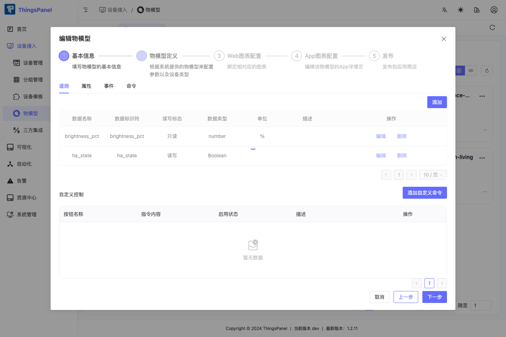
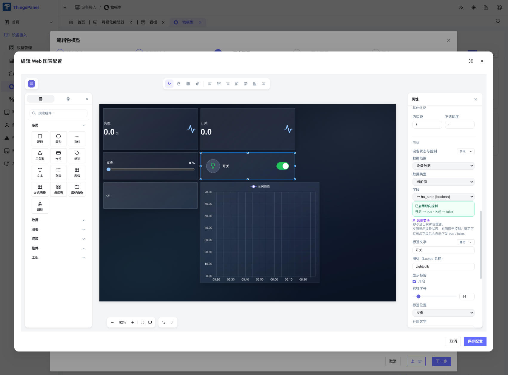

# 在物模型中配置开关字段

本教程说明如何为开关设备配置一个可读、可写的布尔状态字段。完成后，可视化中的开关组件可以读取设备状态，并在用户点击时下发 `true` 或 `false`。

## 前置条件

- 已登录租户管理员账号。
- 已进入“设备接入 → 物模型”。
- 准备创建一个新的物模型；本教程从“无模型创建”开始。

## 配置布尔状态字段

1. 在物模型列表中点击“新建物模型”，填写名称、作者、版本等基本信息。
2. 点击“下一步”，进入“物模型定义”。
3. 选择“遥测”页签，点击“添加”。
4. 填写以下字段：

   | 配置项 | 推荐值 | 说明 |
   | --- | --- | --- |
   | 数据名称 | 开关状态 | 面向用户的显示名称 |
   | 数据标识符 | `ha_state` | 稳定的字段标识，后续绑定使用它 |
   | 读写标志 | 读写 | 必须允许写入，开关才可以控制设备 |
   | 数据类型 | Boolean | 组件会按布尔值处理开和关 |
   | 单位 | 留空 | 开关状态不需要单位 |

5. 点击“确定”，确认表格中出现 `ha_state`，并且“读写标志”为“读写”、“数据类型”为“Boolean”。

## 在物模型的 Web 图表配置中绑定开关

物模型字段配置完成后，还要在同一个向导的 Web 图表配置里绑定组件。不要在物模型列表外直接打开一个已有看板来代替这一步。

1. 在“物模型定义”页点击“下一步”，进入“Web 图表配置”。
2. 点击“新建配置”，进入“编辑 Web 图表配置”。确认内嵌编辑器显示中文菜单，例如“组件库”“控件”“属性”。
3. 展开左侧“控件”，把“开关”拖到画布。
4. 选中开关，在右侧“内容 → 设备状态与控制”中设置：

   | 配置项 | 值 |
   | --- | --- |
   | 绑定模式 | 字段 |
   | 数据范围 | 设备数据 |
   | 数据类型 | 当前值 |
   | 字段 | `ha_state [boolean]` |

5. 确认面板显示“已启用双向控制”和“开启 → `true` · 关闭 → `false`”，点击“保存配置”。

这一步保存的是物模型自己的 Web 图表配置，后续设备模板和可视化看板才能复用同一套开关语义。

如果平台把控制能力单独列在“命令”页，请让对应命令使用同一个标识符 `ha_state`。这样运行时会把遥测字段作为状态回读，把同名命令作为控制下发目标。

:::tip

状态字段和控制命令可以共用同一个标识符：读取走遥测，写入走命令。这是开关、空调电源、门禁启停等二态控制的推荐配置。

:::

## 发布并绑定设备模板

1. 返回向导后，依次完成 App 图表配置和发布步骤；如果暂不发布，也可以先在测试设备模板中验证 Web 配置。
2. 在设备模板中绑定这个物模型。
3. 确认目标设备使用了更新后的设备模板。

已经发布并正在使用的物模型，建议先在测试设备上验证，再推广到生产设备。

## 验证配置

在设备详情中检查：

- 遥测当前值能够显示 `true` 或 `false`。
- 下发控制后，指令记录中出现 `{"ha_state":true}` 或 `{"ha_state":false}`。
- 设备执行命令后，会产生新的 `ha_state` 遥测回报。

## 常见问题

### 开关只能显示，不能控制

通常是字段被设置为“只读”，或者设备模板没有提供同名控制命令。检查“读写标志”和命令标识符是否为 `ha_state`。

### 绑定后显示的是字符串

请把数据类型设为 Boolean，而不是 String、Number 或枚举文本。`on/off` 这类设备协议值可以在设备适配层转换，面向可视化绑定的字段仍建议保持布尔语义。

### 指令显示成功，但状态没有变化

“指令成功”只代表平台接受并发送了命令。还需要等待设备执行后回报新的遥测；如果没有回报，应检查设备连接、命令标识符和设备适配器日志。

## 自动化录制动作

本教程对应的可复用 Playwright CLI 动作是 `model.open-new-switch-web-editor` 和 `model.configure-new-switch-web-binding`，位于 `thingspanel-test-automation/playwright-cli-actions/model/`。
