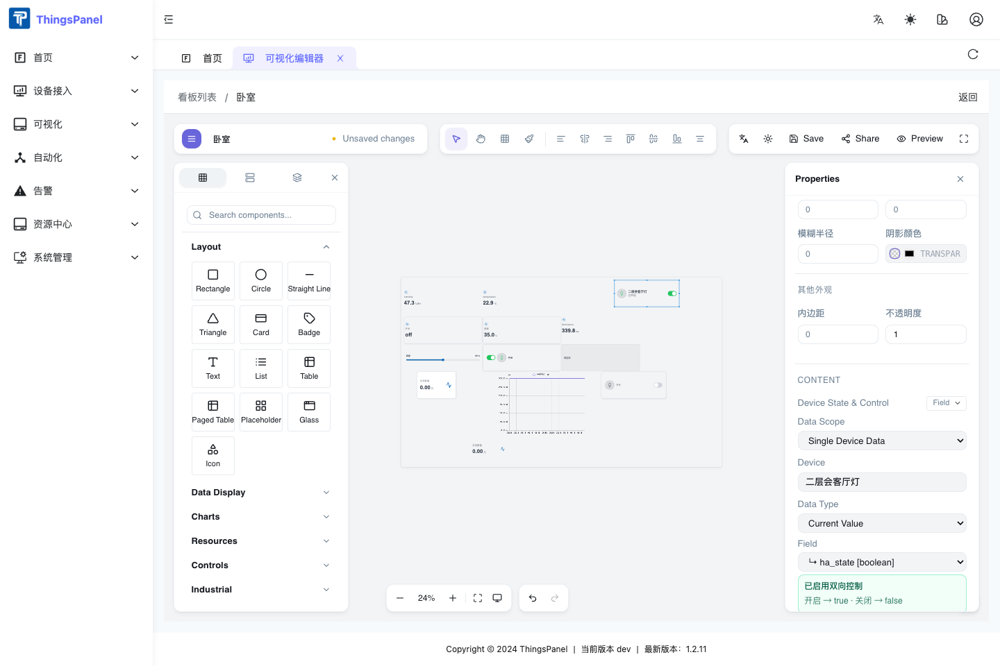
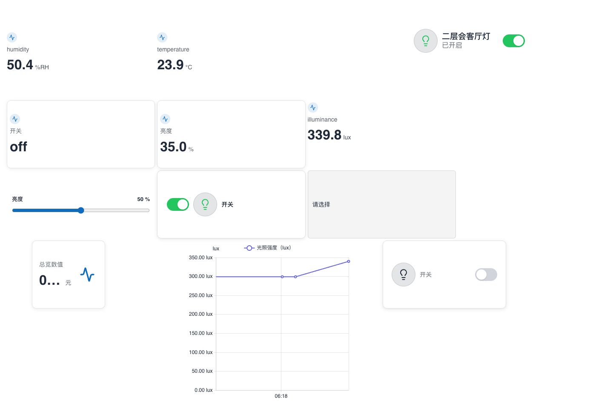

# 在可视化中绑定开关组件

本教程说明如何在 ThingsVis 可视化编辑器中添加开关组件，并绑定物模型中的布尔字段。绑定完成后，组件左侧显示设备名称、图标和状态，右侧用于控制开关。

## 前置条件

- 物模型中已经存在可写的 Boolean 字段，例如 `ha_state`。
- 设备模板已经绑定该物模型。
- 当前设备能够上报这个字段的遥测值。

## 添加并绑定开关组件

1. 打开一个 ThingsVis 看板，点击“编辑”。
2. 在左侧组件库展开“控件”，将“开关”拖到画布。
3. 点击画布中的开关组件，在右侧“属性”面板找到“内容”。
4. 在“设备状态与控制”中设置：

   | 配置项 | 值 |
   | --- | --- |
   | 绑定模式 | Field / 字段 |
   | 数据范围 | 单设备数据 |
   | 设备 | 目标设备，例如“二层会客厅灯” |
   | 数据类型 | 当前值 |
   | 字段 | `ha_state [boolean]` |

5. 确认面板显示“已启用双向控制”。布尔开关会自动使用“开启 → `true`、关闭 → `false`”的写入规则。



不需要再手工配置 `change` 事件或拼接请求体。编辑器保存的是字段绑定，宿主运行时会自动把同名可控字段路由到设备命令。

## 调整开关的显示

建议保留以下默认设置：

- 显示标签：开启。
- 标签位置：左侧。
- 图标、设备名称和状态：左侧。
- 开关轨道：右侧。

设备开启时，图标和状态文字变亮；设备关闭时，图标和状态文字变暗。这样用户可以同时看到状态和控制入口。

## 保存并预览

1. 点击“保存”，等待编辑器显示“所有更改已保存”。
2. 点击“预览”。
3. 在预览页面点击右侧开关，不要在编辑器画布中点击控件来测试设备控制。
4. 等待设备回报遥测，确认标签从“已关闭”变成“已开启”，或反向变化。



完整链路是：

```text
预览点击
  → 下发 ha_state=true/false 命令
  → 设备执行
  → 设备回报 ha_state 遥测
  → 设备详情、图表和开关标签同步
```

## 常见问题

### 字段列表中没有 `ha_state [boolean]`

回到物模型检查字段标识符、数据类型和读写标志。字段需要是 Boolean，并且设备模板需要重新绑定或刷新。

### 只能选到字段，但面板没有双向控制提示

当前字段可能是只读遥测。请确认物模型有同名可写命令，或者字段的读写标志为“读写”。

### 指令记录增加，但图表不变化

检查设备是否真的收到并执行命令。平台的指令记录表示发送成功，不等于设备已经回报状态；图表以设备回报的遥测为准。

### 点击后没有任何变化

请确认是在“预览”页面操作，并检查设备连接状态、命令标识符和设备详情中的遥测时间。

## 自动化录制动作

本教程对应的可复用 Playwright CLI 动作依次是 `thingsvis.open-switch-binding-editor`、`thingsvis.show-switch-binding` 和 `thingsvis.verify-switch-preview`，位于 `thingspanel-test-automation/playwright-cli-actions/thingsvis/`。
