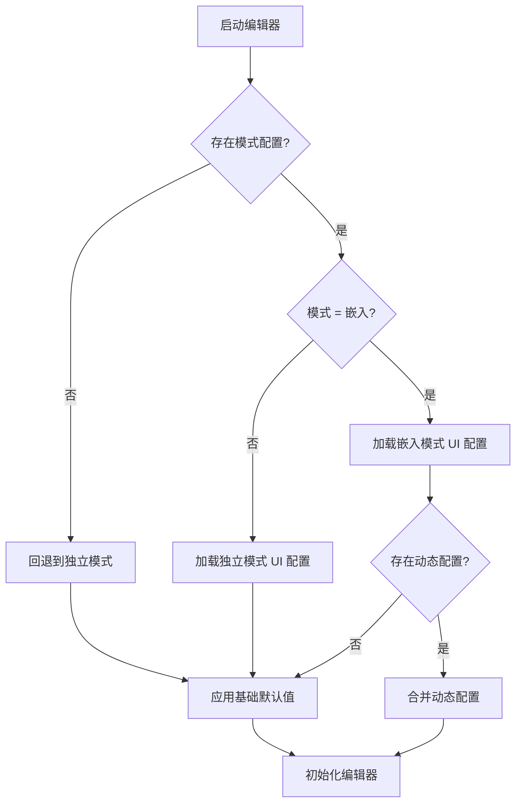

# 功能规格：编辑器服务模式（独立模式 vs 嵌入模式）

**功能分支**: `011-editor-service-modes`  
**创建日期**: 2026-01-15  
**状态**: 草稿  
**输入**: 用户描述: "编辑器应该分独立服务模式和被调用服务模式，不同模式下组件和属性栏的展示行为不同。为实现组件的灵活配置，建议将编辑器进行分层设计，区分公共底座和可配置的动态部分。编辑器独立运行，或灵活集成到第三方平台，需要配置默认传入项目数据，自定义布局。"

## 用户场景与测试 *（必填）*

<!--
  重要：用户故事应该按重要性排序作为用户旅程进行优先级排列。
  每个用户故事/旅程必须能够独立测试 - 即使只实现其中一个，
  也应该有一个可用的 MVP（最小可行产品）来交付价值。
-->

### 用户故事 1 - 模式选择与初始化 (优先级: P1)

作为平台运营者，我可以以独立服务模式或嵌入模式启动编辑器，编辑器会相应地初始化其 UI 行为。

**优先级原因**: 模式选择是解锁所有其他行为的根本能力。

**独立测试**: 使用各模式配置启动编辑器，验证是否加载了正确的行为配置。

**验收场景**:

1. **假设** 编辑器以独立模式启动，**当** 加载完成时，**则** 默认使用独立模式 UI 配置
2. **假设** 编辑器以嵌入模式启动，**当** 加载完成时，**则** 默认使用嵌入模式 UI 配置
3. **假设** 模式配置缺失或无效，**当** 编辑器加载时，**则** 回退到独立模式并显示清晰的警告

---

### 用户故事 2 - 独立模式 UI 默认值 (优先级: P1)

作为独立用户，我可以看到完整的编辑器布局，包括可见的组件库和属性面板，这样我可以在不需要外部集成的情况下构建项目。

**优先级原因**: 独立模式必须自给自足，能够独立使用。

**独立测试**: 启动独立模式，验证默认布局和面板是否可见。

**验收场景**:

1. **假设** 编辑器在独立模式下运行，**当** 加载完成时，**则** 组件库可见
2. **假设** 编辑器在独立模式下运行，**当** 加载完成时，**则** 属性面板可见
3. **假设** 我选择了一个组件，**当** 我打开属性面板时，**则** 我可以编辑组件属性

---

### 用户故事 3 - 嵌入模式 UI 自定义 (优先级: P1)

作为集成方，我可以控制在嵌入模式下组件库和属性面板是显示还是隐藏，以适配我的宿主平台布局。

**优先级原因**: 嵌入模式必须能适应外部布局，避免强制使用固定 UI。

**独立测试**: 使用不同的布局配置启动嵌入模式，验证面板可见性。

**验收场景**:

1. **假设** 编辑器在禁用面板的嵌入模式下运行，**当** 加载完成时，**则** 组件库和属性面板被隐藏
2. **假设** 编辑器在启用面板的嵌入模式下运行，**当** 加载完成时，**则** 组件库和属性面板显示
3. **假设** 编辑器在自定义布局的嵌入模式下运行，**当** 加载完成时，**则** 布局与提供的配置匹配

---

### 用户故事 4 - 顶部区域与工具栏可配置 (优先级: P1)

作为集成方，我可以配置左上角、右上角和工具栏的显示与包含项，让编辑器适配宿主平台布局。

**为什么优先**: 顶部区域与工具栏是嵌入场景下最显眼的可配置入口。

**独立测试**: 使用不同配置启动嵌入模式，验证顶部区域和工具栏按配置显示。

**验收场景**:

1. **假设** 嵌入模式配置隐藏左上角区域，**当** 加载完成时，**则** 左上角不显示
2. **假设** 嵌入模式配置隐藏右上角区域，**当** 加载完成时，**则** 右上角不显示
3. **假设** 嵌入模式配置了工具栏项，**当** 加载完成时，**则** 仅显示配置项

---

### 用户故事 5 - 集成等级：完整与最简 (优先级: P1)

作为集成方，我可以选择“完整集成”或“最简集成”，适配不同功能场景。

**为什么优先**: ThingsPanel 平台需要两种集成方式。

**独立测试**: 在两种集成等级下启动编辑器，验证可见范围符合预期。

**验收场景**:

1. **假设** 选择完整集成，**当** 加载完成时，**则** 大组件区域可按配置显示或隐藏
2. **假设** 选择最简集成，**当** 加载完成时，**则** 仅显示最简编辑界面
3. **假设** 最简集成下配置了非最简面板，**当** 加载时，**则** 被忽略并提示

---

### 用户故事 6 - 默认项目数据注入 (优先级: P1)

作为集成方，我可以将默认项目数据传入编辑器，使其以预定义的项目状态打开。

**优先级原因**: 嵌入场景依赖外部数据来初始化编辑器。

**独立测试**: 使用示例项目数据启动嵌入模式，验证编辑器是否以该状态打开。

**验收场景**:

1. **假设** 嵌入模式以默认项目数据启动，**当** 编辑器加载时，**则** 项目以提供的数据打开
2. **假设** 默认项目数据无效，**当** 编辑器加载时，**则** 拒绝数据并显示清晰的错误
3. **假设** 没有提供默认项目数据，**当** 编辑器加载时，**则** 以空项目状态启动

---

### 用户故事 7 - ThingsPanel 画布配置与保存选择 (优先级: P1)

作为 ThingsPanel 平台用户，我可以加载平台保存的画布完整配置（包含字段绑定信息）进行预览和编辑，并在保存时选择存到 ThingVis 或 ThingsPanel。
**为什么优先**: 平台需要在编辑器内完成配置回写与管理。
**独立测试**: 加载平台画布配置并编辑，选择不同保存目标，验证保存结果正确。
**验收场景**:

1. **假设** 平台提供画布配置，**当** 加载完成时，**则** 可预览和编辑且绑定关系保留
2. **假设** 保存目标为 ThingVis，**当** 点击保存时，**则** 数据保存到 ThingVis
3. **假设** 保存目标为 ThingsPanel，**当** 点击保存时，**则** 数据保存到 ThingsPanel
4. **假设** ThingsPanel 保存失败，**当** 出错时，**则** 显示清晰错误且数据不丢失

---

### 用户故事 8 - 设备模板图表绑定 (优先级: P1)

作为设备模板设计者，我可以绑定图表与属性/遥测字段，使每个设备的数据独立，并在设备详情页正确渲染。
**为什么优先**: 设备模板是 IoT 平台的核心业务。
**独立测试**: 绑定模板并生成多个设备，验证数据互不影响且设备详情页可渲染。
**验收场景**:

1. **假设** 我绑定了模板属性/遥测字段，**当** 生成设备时，**则** 每个设备图表数据独立
2. **假设** 我修改一个设备图表数据，**当** 切换到另一个设备时，**则** 其数据不受影响
3. **假设** 我保存模板配置，**当** 重新打开时，**则** 绑定关系保持
4. **假设** 我进入设备详情页，**当** 页面渲染时，**则** 使用当前设备的数据完成渲染
5. **假设** 我在组件属性面板选择数据源，**当** 列表出现时，**则** 仅展示平台提供的属性/遥测字段

---

### 用户故事 9 - 可配置部分的分层架构 (优先级: P2)

作为产品团队，我们可以将编辑器分离为稳定的基础层和可配置的动态部分，这样我们可以在不更改核心的情况下自定义行为。

**优先级原因**: 分层减少耦合，随时间推移实现灵活集成。

**独立测试**: 验证基础层可以使用最小配置工作，动态部分可以在不破坏基础层的情况下替换。

**验收场景**:

1. **假设** 只有基础层存在，**当** 编辑器加载时，**则** 核心编辑功能仍然可用
2. **假设** 配置了动态部分，**当** 编辑器加载时，**则** 反映配置的组件、面板和布局
3. **假设** 移除了动态配置，**当** 编辑器重新加载时，**则** 回退到基础默认值且不会失败

---

### 边界情况

- 设备缺少绑定字段：显示缺失提示并跳过该字段渲染
- 平台未提供数据源字段列表：属性面板显示不可用提示
- 缺少模式配置：编辑器默认使用独立模式并警告用户
- 布局设置冲突：编辑器解析为确定性布局并报告冲突
- 嵌入宿主提供部分配置：编辑器与基础默认值合并
- 默认项目数据超过允许大小：编辑器拒绝并报告原因
- 最简集成提供完整配置：忽略非最简配置并提示
- 保存目标不可用：阻止保存并提示原因
- 尝试在运行时切换模式：编辑器需要重新加载并告知不支持切换

## 需求 *（必填）*

### 功能需求

**模式管理**
- **FR-001**: 系统必须支持至少两种模式：独立服务模式和嵌入模式
- **FR-002**: 系统必须根据模式配置加载正确的 UI 行为配置
- **FR-003**: 系统必须在模式配置缺失或无效时回退到独立模式
- **FR-004**: 系统必须在回退发生时提供清晰的警告

**独立模式**
- **FR-005**: 系统必须在独立模式下默认显示组件库
- **FR-006**: 系统必须在独立模式下默认显示属性面板
- **FR-007**: 系统必须允许在独立模式下编辑组件属性

**嵌入模式**
- **FR-008**: 系统必须允许配置在嵌入模式下显示或隐藏组件库
- **FR-009**: 系统必须允许配置在嵌入模式下显示或隐藏属性面板
- **FR-010**: 系统必须允许在嵌入模式下使用自定义布局配置
- **FR-010a**: 系统必须允许配置在嵌入模式下显示或隐藏左上角区域
- **FR-010b**: 系统必须允许配置在嵌入模式下显示或隐藏右上角区域
- **FR-010c**: 系统必须允许配置在嵌入模式下设置工具栏显示与项目
- **FR-010d**: 系统必须支持“最简集成”，限制可见区域为最简集成范围
- **FR-010e**: 系统必须支持“完整集成”，允许大组件区域显示或隐藏

**默认项目数据**
- **FR-011**: 系统必须在嵌入模式下接受可选的默认项目数据
- **FR-012**: 系统必须在数据有效时使用提供的项目数据加载编辑器
- **FR-013**: 系统必须以清晰的错误拒绝无效数据
- **FR-014**: 系统必须在没有提供数据时以空项目启动

**ThingsPanel 集成**
- **FR-018**: 系统必须支持加载平台保存的画布完整配置（包含字段绑定信息）
- **FR-019**: 系统必须支持保存目标选择：ThingVis 或 ThingsPanel
- **FR-020**: 系统必须对保存成功进行明确提示
- **FR-021**: 系统必须在 ThingsPanel 保存失败时提供清晰错误且不丢失数据
- **FR-022**: 系统必须支持设备模板绑定，保证每个设备数据独立
- **FR-023**: 系统必须在设备详情页根据设备上下文渲染图表与绑定数据
- **FR-024**: 系统必须在组件属性面板提供平台下发的属性/遥测字段作为数据源选项
- **FR-025**: 系统必须不要求在模板配置中手动配置数据源连接信息

**分层设计**
- **FR-015**: 系统必须将稳定的基础层与可配置的动态部分分离
- **FR-016**: 系统必须在缺少动态配置时使用基础默认值运行
- **FR-017**: 系统必须允许动态配置在不改变基础行为的情况下修改组件、面板和布局

### 关键实体

- **设备上下文**: 设备详情页当前设备的标识与数据集
- **数据源字段列表**: 平台下发的属性/遥测字段清单
- **模式配置**: 定义编辑器是在独立模式还是嵌入模式下运行
- **UI 行为配置**: 控制给定模式下面板可见性和布局的规则集
- **动态配置**: 覆盖基础默认值的可选配置（组件、面板、布局）
- **默认项目数据**: 用于初始化编辑器的外部项目数据
- **集成等级**: 完整集成或最简集成的可见范围定义
- **保存目标**: 数据保存的目标（ThingVis 或 ThingsPanel）
- **设备模板绑定**: 模板图表与设备属性的关联

## 假设

- 平台在进入编辑器或设备详情页时提供当前设备上下文与字段列表
- 模式配置在编辑器初始化之前提供
- 嵌入宿主可以在启动时提供配置和项目数据
- 运行时切换模式不在本版本范围内
- 基础默认值足以在没有自定义的情况下提供可用的编辑器
- 最简集成将隐藏所有非必要的面板与顶部区域

## 成功标准 *（必填）*

### 可衡量的结果

- **SC-001**: 用户可以启动任一模式，并在首次加载时看到正确的 UI 配置
- **SC-002**: 嵌入集成可以隐藏或显示面板而不影响基础编辑功能
- **SC-003**: 对于典型项目，默认项目数据在 2 秒内成功加载
- **SC-004**: 无效配置或数据 100% 产生清晰、可操作的错误
- **SC-005**: 即使缺少动态配置，基础模式仍然保持功能正常
- **SC-006**: 数据可成功保存到 ThingVis 或 ThingsPanel 且不丢失
- **SC-007**: 设备模板绑定后，每个设备数据保持独立
- **SC-008**: 设备详情页能够基于设备上下文正确渲染绑定图表

## 流程图 *（必填）*

## 不在范围内 *（必填）*

- 运行时切换模式而不重新加载
- 定义项目数据的内部数据模式
- 超出初始配置的宿主与编辑器通信协议
